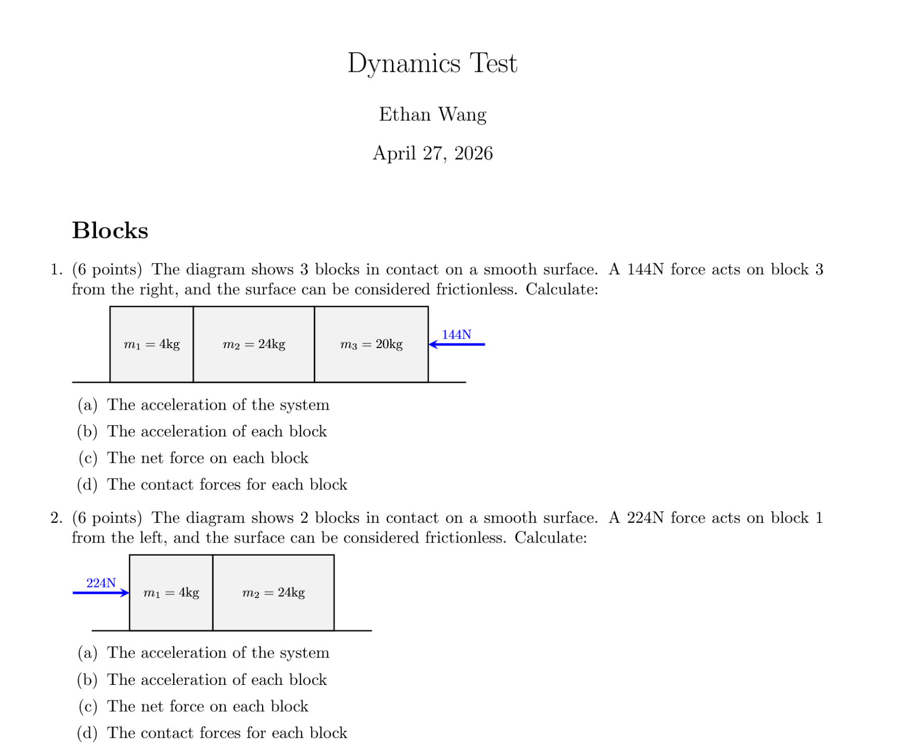

# physics exam gen

Program written in python that uses LaTeX to generate PDFs of physics exercise questions. Might include manim for animations.

First project for Horizons Hack Club.

## Progress

Working on river problems relative motion kinematics you can see in `dev\questions\kinematics\river_exam.pdf`. No diagram yet.

Still experimenting. Sample dynamics exercise questions in `dev\questions\dynamics\block_exam.pdf`, answers in `dev\questions\dynamics\block_exam_answers.pdf`  
[here](dev/questions/dynamics/block_exam.pdf)

## Notes

- [latex exam document class](https://math.mit.edu/~psh/exam/examdoc.pdf)
- [math examgen](https://github.com/thearn/examgen)
- [overleaf](https://www.overleaf.com/)